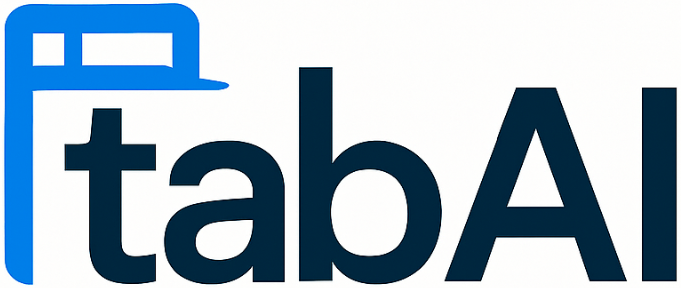

# TabAI - Multiple AI Assistants

TabAI is a desktop application that provides a unified interface for accessing multiple AI chatbot services (Claude, ChatGPT, Gemini, DeepSeek, and Mistral) in a single window with tabbed navigation.



## Features

- **Unified Interface**: Access multiple AI assistants from a single application
- **Tabbed Navigation**: Switch between different AI services using tabs
- **Navigation Controls**: Back, forward, and refresh buttons for each AI service
- **Keyboard Shortcuts**: Quickly switch between tabs using Ctrl+Tab and Ctrl+Shift+Tab
- **Modern UI**: Clean, intuitive interface with dark mode support

## Installation

### Prerequisites

- [Node.js](https://nodejs.org/) (v14 or higher)
- [npm](https://www.npmjs.com/) (usually comes with Node.js)

### Development Setup

1. Clone the repository:
   ```
   git clone https://github.com/your-username/tabai.git
   cd tabai/tabai-electron
   ```

2. Install dependencies:
   ```
   npm install
   ```

3. Start the development version:
   ```
   npm start
   ```

### Building for Production

To build the application for your platform:

```
npm run build
```

This will create distributable packages in the `dist` directory.

## Usage

### Starting the Application

Launch TabAI from your applications menu or by running:

```
npm start
```

### Opening AI Assistants

1. From the home screen, click on any AI assistant button to open it in a new tab
2. Alternatively, click the "+" button in the tab bar to select an AI assistant

### Navigating Between Tabs

- Click on any tab to switch to it
- Use **Ctrl+Tab** to cycle to the next tab
- Use **Ctrl+Shift+Tab** to cycle to the previous tab
- Use **Ctrl+[Number]** to switch to a specific tab (e.g., Ctrl+1 for the first tab)

### Navigation Controls

When viewing an AI assistant:
- Use the back and forward buttons to navigate through your session history
- Use the refresh button to reload the current page

### Keyboard Shortcuts

- **Ctrl+Tab**: Switch to the next tab
- **Ctrl+Shift+Tab**: Switch to the previous tab
- **Ctrl+1, Ctrl+2, etc.**: Switch to a specific tab by number

## Security Note

TabAI attempts to embed AI services directly in the application. However, many AI services have security measures that prevent embedding. In such cases, TabAI will:

1. Try to bypass these restrictions when possible
2. Fall back to opening the service in your default browser if embedding fails

## Technical Details

TabAI is built with:
- [Electron](https://www.electronjs.org/) for cross-platform desktop functionality
- HTML/CSS/JavaScript for the user interface
- BrowserView for embedding web content

## Contributing

Contributions are welcome! Please feel free to submit a Pull Request.

## License

SafeAI Solutions by Emre Dost © 2025 All rights reserved

## Contact

For questions or support, please contact: [your-email@example.com] 